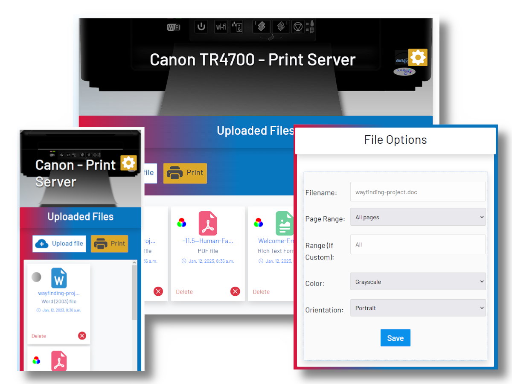

# printer-gui
Django web app for RPi to handle print jobs using a connected CUPS printer.

## Requirements
- Python3.8.3
- Raspberry Pi or similar SBC with networking capability
- A Wi-Fi network with a connected wireless printer

## About
This is nothing fancy; I wrote it over the course of a few hours
and it gets the job done. This app was designed to run on a Raspberry
Pi on which I have connected a CUPS profile to my parents' Epson XP-310
Wi-Fi printer. They somehow succeed to render their laptops incapable
of printing every couple of weeks and I end up fixing them. Now I just
tell them to use the bookmark to my print server so I won't get any
distressed calls about not being able to print!

## Limitations
- Currently, I have only implemented this for printing DOCX and PDF.
- I did not use sessions. That means if someone clicks "Print Files"
while another person in the house is uploading some files, whatever
that other person has uploaded will print and be cleared from the queue
as well. Not a big deal in my house but you can easily fix this by using
user sessions with the django.contrib.auth.models.User model.

## Setup
Follow the steps below to convert your single-board computer into
a printer server on your subnet.

### 1) Connect your printer via CUPS
On your sinble-board computer, you will first need to connect to your
printer using CUPS. I was not in the mood for reading command-line
documentation and was able to set this up in a few minutes using the
CUPS web GUI. There are many tutorials on how to do this such as this
one (https://www.howtogeek.com/169679/how-to-add-a-printer-to-your-raspberry-pi-or-other-linux-computer/).
Note the printer name; you will need it soon.

### 2) Install some necessary utilities
My printer server only handles 2 file types: PDF and DOCX. Yes, I am
that lazy but I'm sure if you so desire, you can modify this app to
support all your fancy file types. Anyway, you will need to install
pandoc 2.2.1 and texlive-latex-extra 2018.20190227-2. These utilities
are used by the file_printer module to automagically convert DOCX to PDF
for printing.

### 3) Replace some strings
You will notice that my printer/file_printer.py module has several
"EPSON_XP_310_Series" strings; replace all of these with your own
printer name that you chose when configuring your CUPS printer.

### 4) Setup the virtualenv
You will need to create your Python virtualenv in the root directory
of this project, activate it, and install the required packages:

    python3 -m venv venv
    source venv/bin/activate
    pip3 install -r requirements.txt

### 5) Make the DB migrations
With the virtualenv activated, migrate the database by entering the
following commands in this project's root directory:

    python3 manage.py makemigrations printer
    python3 manage.py migrate
    
### 6) Give your device a static IP
You will, of course, need a static IP address. On most distros, you
can configure your IP address in /etc/dhcpcd.conf by setting
"static ip_address", "static domain_name_servers" and "static routers".
If you run RaspberryPi OS or something similar, there are many tutorials
for doing this. Note the IP address you choose, you will need it in the
next step.

### 7) Add your IP address in printer/settings.py
Open the settings.py file and enter your server's IP address as a string
in the ALLOWED_HOSTS list. I leave DEBUG as True in my settings file since
this just runs on a subnet and I would prefer to see any exception output.

### 8) Run the server
Ensure your virtualenv is activated ("source venv/bin/activate"). You may
now test your server using the following command:

        python3 manage.py runserver <your-ip>:8000

Try visiting the server's adddress from one of your Wi-Fi connected devices
(http://your-ip:8000). Upload some test files, configure the options, and
print them out if you wish. After you have tested, you may want to run this
in the background which you can do using my "start_in_background.bash" script.
Of course, you could get a little bit fancier and create a service file if
you prefer!
