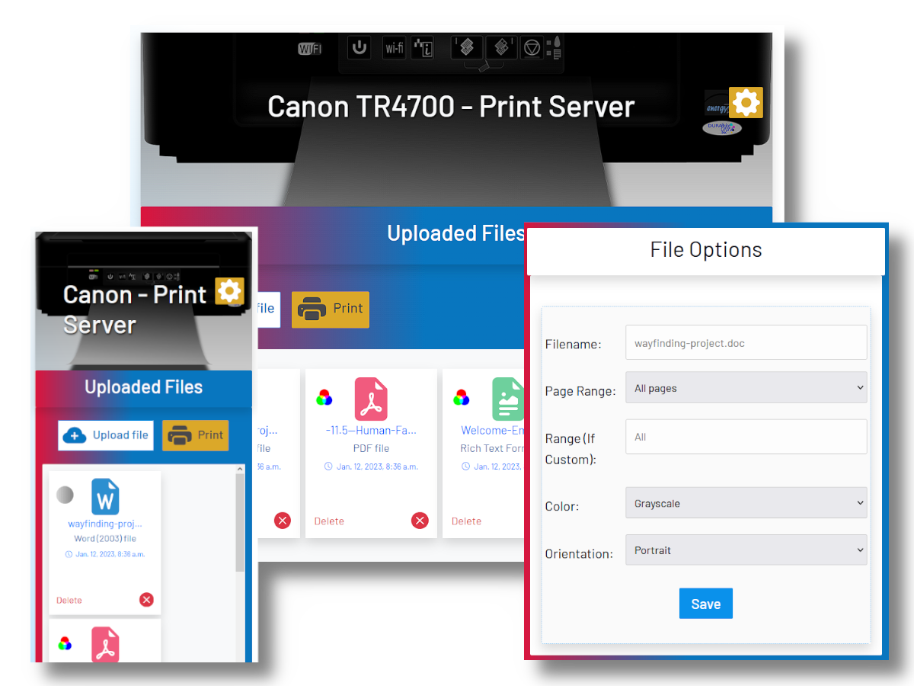
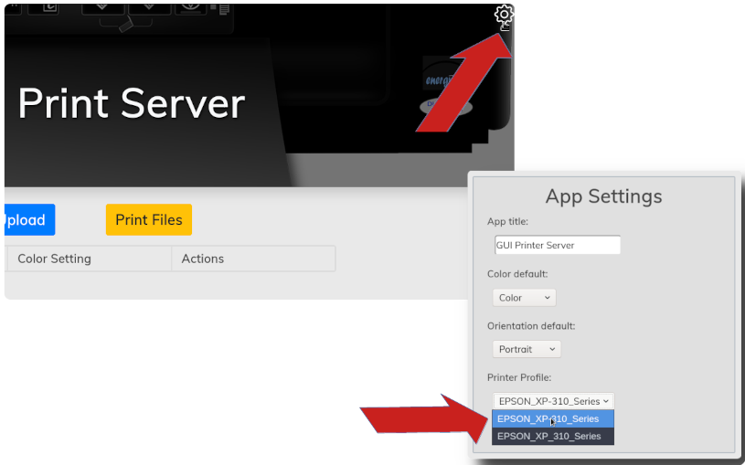

***********
printer-gui
***********

| Django web app for RPi to handle print jobs using a connected CUPS printer.

Changes
#######

- Capturing ``stderr`` from subprocesses to convey errors to the user.
- Leveraging Django's Messages Framework to display statuses and exceptions.
- Removed dependency on ``libreoffice``; only CUPS-supported formats are accepted.
- Re-designed UI for better look/feel. -- Improved mobile/overall experience.
- Added a favicon to better distinguish the browser tab.

Requirements
############

- Raspberry Pi or similar SBC with networking capability
- Python 3.10+ (required by Django 5.2) and the ``pip`` package installer on the SBC's OS.
- Ability to install CUPS so the ``lp`` command is available to the application.
- A network printer connected on the local network

Limitations
###########
- Only pdf, ps, txt, jpg, jpeg, png, gif, and tiff files are supported.
- It seems that some printers may not respect page orientation chosen.
- No sessions.

| Because I have not yet implemented sessions, if someone clicks
| "Print Files" while another person on the network is uploading
| some files, whatever that other person has uploaded will print
| and be cleared from the queue as well. Not a big deal in my
| house but I may implement separate sessions in the future to
| address this flaw.

Setup
#####

| Follow the steps below to convert your single-board computer
| into a printer server on your local network.

1) Connect your printer via CUPS
--------------------------------
| On your single-board computer, you will first need to connect
| to your printer using CUPS. I was not in the mood for reading
| command-line documentation and was able to set this up in a
| few minutes using the CUPS web GUI. There are many tutorials
| on how to do this such as `this one <https://www.howtogeek.com/169679/how-to-add-a-printer-to-your-raspberry-pi-or-other-linux-computer/>`_.

2) Install system packages
--------------------------
| Install the CUPS packages so the ``lp`` command is available to Django.
| LibreOffice and Java are no longer required because the app only accepts
| formats handled directly by CUPS. On Debian/Ubuntu:

.. code:: bash

    sudo apt update
    sudo apt install cups
    sudo usermod -aG lpadmin $USER
    sudo systemctl enable --now cups

| On other distributions, install the package that provides ``lp`` (often
| named ``cups`` or ``cups-client``).

3) Setup the virtualenv
-----------------------
| The project no longer includes an install script. Create your Python
| virtualenv in the root directory for this project, activate it, and
| install the required packages manually:

.. code:: bash

    python3 -m venv venv
    source venv/bin/activate
    pip3 install -r requirements.txt

4) Run database migrations
--------------------------
| With the virtualenv enabled (``source venv/bin/activate``), create and
| apply the database migrations:

.. code:: bash

    python manage.py makemigrations
    python manage.py migrate

| The application now creates the initial ``Settings`` record
| automatically, so no manual shell steps are required.

5) Give your device a static IP
-------------------------------
| You will, of course, need a static IP address. On Raspberry Pi
| OS, you can configure your IP address in /etc/dhcpcd.conf by
| setting "static ip_address", "static domain_name_servers", and
| "static routers". A simple example is given below:

.. code:: bash

    interface wlan0
      static ip_address=192.168.1.4
      static domain_name_servers=192.168.1.1
      static routers=192.168.1.1

6) Add your IP address in printer/settings.py
---------------------------------------------
| Open the settings.py file and enter your server's IP address as
| a string in the ALLOWED_HOSTS list.

7) Start the development server
-------------------------------
| Activate the virtualenv and run the Django development server on your
| static IP (or ``0.0.0.0`` if you prefer to listen on every interface):

.. code:: bash

    source venv/bin/activate
    python manage.py runserver 0.0.0.0:8000

| The repository includes a simple ``start.bash`` helper for Raspberry Pi
| deployments. Set the ``PRINTER_GUI_BIND_ADDRESS`` environment variable
| to override the default bind address (``0.0.0.0:8000``) before using it,
| if desired. You can then launch the server with:

.. code:: bash

    ./start.bash
    Watching for file changes with StatReloader
    Performing system checks...

    System check identified no issues (0 silenced).
    January 04, 2021 - 17:40:26
    Django version 5.2.6, using settings 'printer.settings'
    Starting development server at http://<STATIC_IP>:8000/
    Quit the server with CONTROL-C.

| Assuming the server runs correctly, you may configure the
| server to run automatically on startup as a systemd service.
| On the Raspberry Pi, copy the 'printerserver.service' file
| to '/etc/systemd/system/', review the ``User``, ``Group``, and
| ``WorkingDirectory`` directives, and adjust them if your
| environment differs from the defaults. The service reads
| optional overrides from ``/etc/default/printerserver``; you can
| define ``PRINTER_GUI_BIND_ADDRESS`` there to change the bind
| address without editing the unit file. For example:

.. code:: bash

    echo "PRINTER_GUI_BIND_ADDRESS=192.168.1.4:8000" | sudo tee /etc/default/printerserver

| Start and enable it once it matches your setup.

.. code:: bash

    sudo cp /home/pi/printer-gui/printerserver.service /etc/systemd/system/
    sudo systemctl start printerserver
    sudo systemctl enable printerserver

| To check the status of the service and debug, use:
|
| ``systemctl status printerserver``, and
| ``sudo journalctl -u printerserver``

8) Configure the server to use your printer
-------------------------------------------
| The printer server has not yet been configured to use your
| CUPS printer profile. With the server running, visit its
| URL in a web browser from a device on the same network
| (e.g. http://192.168.1.4:8000). Locate and click the
| settings icon as pictured below:

| As you can see in the picture, you can also set a title and
| defaults for the print server. Now the server should be able
| to print correctly. Upload some test files, configure the
| options, and print out the files if you wish.
