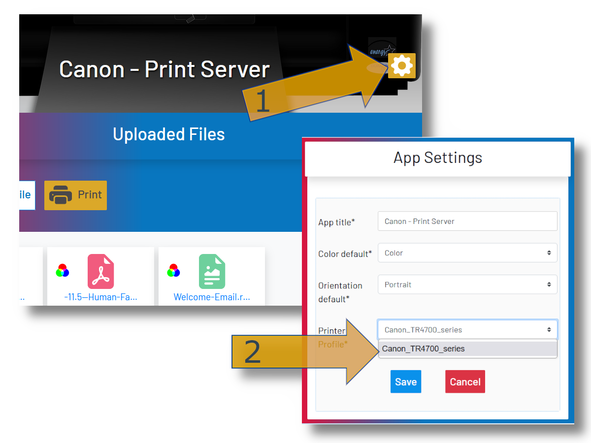

***********
printer-gui
***********

| Django web app for RPi to handle print jobs using a connected CUPS printer.

.. image:: ./screenshots/preview.png
    :width: 800
    :alt: Printer-GUI's desktop and mobile views

Changes
#######

- Capturing ``stderr`` from subprocesses to convey errors to the user.
- Leveraging Django's Messages Framework to display statuses and exceptions.
- Added Docuvert-powered conversion so common Office formats are rendered to
  PDF automatically while files CUPS handles natively continue to bypass
  conversion.
- Re-designed UI for better look/feel. -- Improved mobile/overall experience.
- Added a favicon to better distinguish the browser tab.
- Added per-session print queues so simultaneous users do not consume each other's jobs.

Requirements
############

- Raspberry Pi or similar SBC with networking capability
- Python 3.10+ (required by Django 5.2) and the ``pip`` package installer on the SBC's OS.
- Ability to install CUPS so the ``lp`` command is available to the application.
- A network printer connected on the local network
- Docuvert 1.1.2 to convert Office documents and OpenDocument files to PDF before printing

Limitations
###########
- Formats beyond pdf, ps, txt, jpg, jpeg, png, gif, tif/tiff, doc/docx,
  ppt/pptx, xls/xlsx, odt/odp/ods, and rtf remain unsupported.
- It seems that some printers may not respect page orientation chosen.

Setup
#####

| Follow the steps below to convert your single-board computer
| into a printer server on your local network.

1) Connect your printer via CUPS
--------------------------------
| On your single-board computer, you will first need to connect
| to your printer using CUPS. I was not in the mood for reading
| command-line documentation and was able to set this up in a
| few minutes using the CUPS web GUI. There are many tutorials
| on how to do this such as `this one <https://www.howtogeek.com/169679/how-to-add-a-printer-to-your-raspberry-pi-or-other-linux-computer/>`_.

2) Install system packages
--------------------------
| Install the CUPS packages so the ``lp`` command is available to Django.
| LibreOffice remains unnecessary; Docuvert (installed via ``pip``) now
| handles Office/OpenDocument conversions. On Debian/Ubuntu:

.. code:: bash

    sudo apt update
    sudo apt install cups
    sudo usermod -aG lpadmin $USER
    sudo systemctl enable --now cups

| On other distributions, install the package that provides ``lp`` (often
| named ``cups`` or ``cups-client``).

3) Download the project files
-----------------------------
| Move the application's source code onto the single-board computer before
| continuing. If ``git`` is available, cloning your fork of the repository
| keeps it easy to pull in future updates:

.. code:: bash

    cd /opt
    git clone https://github.com/JPWTCK/printer-gui.git
    cd printer-gui

| You can also transfer the project directory from another machine with
| ``scp``, ``rsync``, or a USB drive. The remaining steps assume commands are
| run from the project's root directory on the SBC.

4) Setup the virtualenv
-----------------------
| The project no longer includes an install script. Create your Python
| virtualenv in the root directory for this project, activate it, and
| install the required packages manually:

.. code:: bash

    python3 -m venv venv
    source venv/bin/activate
    pip3 install -r requirements.txt

| The included startup helpers run ``collectstatic`` before launching the
| server so WhiteNoise always has the latest assets. If you start Django with
| another command (for example, ``python manage.py runserver``), run the
| following first to build the static asset manifest:

.. code:: bash

    python manage.py collectstatic --no-input

5) Database initialization (automatic)
--------------------------------------
| The application now ships with its database migrations and applies them
| automatically the first time the server starts, so there is no separate
| setup step to run.
|
| If you prefer to manage the database manually you can still apply the
| migrations yourself:

.. code:: bash

    python manage.py migrate

| Set the ``PRINTER_GUI_AUTO_APPLY_MIGRATIONS`` environment variable to ``0``
| to opt out of the automatic migration behavior when needed.

6) Locate your device on the network (optional)
-----------------------------------------------
| The application automatically adds any hostnames and IP addresses that
| belong to the machine to Django's ``ALLOWED_HOSTS`` list. On Raspberry
| Pi OS and many other Linux distributions, you can usually reach the
| device with ``http://<HOSTNAME>.local:8000`` immediately. Assigning a
| static IP address is no longer required, though you can still set one if
| you prefer a predictable address.

7) Start the Gunicorn application server
---------------------------------------
| Activate the virtualenv and start Gunicorn using the bundled WSGI entry
| point. Adjust the worker count for your hardware (two workers are a good
| starting point for a Raspberry Pi 4):

.. code:: bash

    source venv/bin/activate
    gunicorn --workers 2 --bind 0.0.0.0:8000 printer.wsgi:application

| After Gunicorn starts, visit the site in a browser and make sure the UI is
| styled. You can also request a known static asset directly to confirm
| WhiteNoise is serving the collected files:

.. code:: bash

    curl -I http://<HOSTNAME>.local:8000/static/css/style.css

| The repository includes a simple ``printergui.bash`` helper for Raspberry Pi
| deployments. Set the ``PRINTER_GUI_BIND_ADDRESS`` environment variable
| to override the default bind address (``0.0.0.0:8000``) and
| ``PRINTER_GUI_GUNICORN_WORKERS`` to control the number of worker
| processes before using it, if desired. The helper also refreshes the
| static asset manifest automatically before Gunicorn starts. You can then
| launch the server with:

.. code:: bash

    ./printergui.bash
    [2025-01-04 17:40:26 +0000] [1234] [INFO] Starting gunicorn 23.0.0
    [2025-01-04 17:40:26 +0000] [1234] [INFO] Listening at: http://0.0.0.0:8000 (1234)
    [2025-01-04 17:40:26 +0000] [1234] [INFO] Using worker: sync
    [2025-01-04 17:40:26 +0000] [1235] [INFO] Booting worker with pid: 1235

| For local development with automatic reloads you can still run
| ``python manage.py runserver``, but prefer Gunicorn (or another
| production-grade server) for network-accessible deployments.

| Assuming the server runs correctly, you may configure the
| server to run automatically on startup as a systemd service.
| On the Raspberry Pi, copy the 'printergui.service' file
| to '/etc/systemd/system/', review the ``User``, ``Group``,
| ``WorkingDirectory``, and ``ExecStart`` directives, and adjust
| them if your environment differs from the defaults. The service reads
| optional overrides from ``/etc/default/printergui``; you can
| define ``PRINTER_GUI_BIND_ADDRESS`` there to change the bind
| address, ``PRINTER_GUI_GUNICORN_WORKERS`` to tune the worker
| count, and ``PRINTER_GUI_ALLOWED_HOSTS`` to permit additional
| hostnames without editing the unit file. For example:

.. code:: bash

    echo "PRINTER_GUI_BIND_ADDRESS=192.168.1.4:8000" | sudo tee /etc/default/printergui
    echo "PRINTER_GUI_GUNICORN_WORKERS=3" | sudo tee -a /etc/default/printergui
    echo "PRINTER_GUI_ALLOWED_HOSTS=printer.example.com,printer.local" | sudo tee -a /etc/default/printergui

| The unit invokes ``printergui.bash`` so each restart refreshes the static assets
| automatically before Gunicorn launches. If you customize the unit to call
| Gunicorn directly, keep a ``collectstatic`` step in your workflow.

| Start and enable it once it matches your setup. The repository includes a helper
| script to copy the unit file into place, reload systemd, and optionally enable
| and start the service:

.. code:: bash

    cd /home/pi/printer-gui
    sudo ./install-service.bash --enable --start

| By default the script installs ``printergui.service`` to
| ``/etc/systemd/system``. Use ``--service-file`` or ``--target-dir`` to point to
| custom locations, and pass ``--enable`` and ``--start`` (or ``--now``) only when
| you are ready for the service to run automatically. If you prefer to execute
| the steps manually, run:

.. code:: bash

    sudo cp /home/pi/printer-gui/printergui.service /etc/systemd/system/
    sudo systemctl start printergui
    sudo systemctl enable printergui

| To check the status of the service and debug, use:
|
| ``systemctl status printergui``, and
| ``sudo journalctl -u printergui``

7) Configure the server to use your printer
-------------------------------------------
| The printer server has not yet been configured to use your
| CUPS printer profile. With the server running, visit its
| URL in a web browser from a device on the same network
| (e.g. http://<HOSTNAME>.local:8000). Locate and click the
| settings icon as pictured below:

| As you can see in the picture, you can also set a title and
| defaults for the print server. Now the server should be able
| to print correctly. Upload some test files, configure the
| options, and print out the files if you wish.
